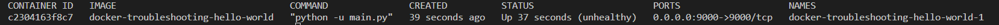

# Docker Troubleshooting

The Docker app hello-world when deployed is unhealthy!  Troubleshoot and implement to a healthy deployment.

Instructions
- Fork this repository
- Build and Run the microservice locally, Assess, identify and resolve the problem with the app
- Send `e@mechanicode.io` your repository link

# Local Development
- [Docker](https://docs.docker.com/engine/install/)
- [curl](https://help.ubidots.com/en/articles/2165289-learn-how-to-install-run-curl-on-windows-macosx-linux)
